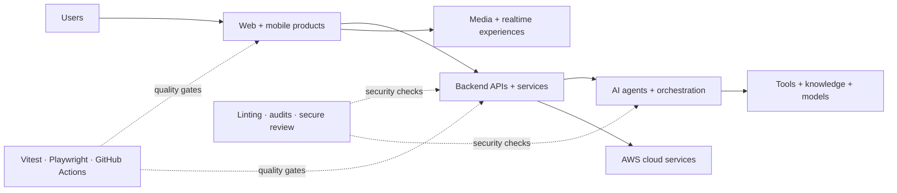

```text
$ whoami
Abhay Jani — AI Systems & Full-Stack Engineer
Building intelligent agents, cloud backends, and cross-platform products.
```

I’m an AI and full-stack product engineer based in India. My work spans AI agent design, LLM-powered product experiences, backend services, AWS cloud systems, and complex web and mobile applications. Most of my production work lives inside private organization repositories, where I build new capabilities, modernize architecture, and make releases safer through strong testing and delivery practices.


[](https://www.typescriptlang.org/)
[](https://angular.dev/)
[](https://ionicframework.com/)
[](https://capacitorjs.com/)
[](https://aws.amazon.com/)
[](https://playwright.dev/)
[](https://vitest.dev/)
[](https://github.com/features/actions)

## `01 / About`

- Design AI agents, tool-driven workflows, knowledge/context systems, and LLM-powered product features.
- Build backend APIs and services that connect identity, data, media, automation, and intelligent capabilities.
- Work with AWS services and delivery infrastructure, including Cognito, S3, CloudFront, and the AWS SDK.
- Build and maintain large Angular, Ionic, and Capacitor applications across web, Android, and iOS.
- Modernize legacy code through framework upgrades, stricter TypeScript, clearer component contracts, and maintainable state/API boundaries.
- Design quality systems spanning unit, integration, smoke, and end-to-end testing.
- Work with realtime communication, rich media, internationalization, and interactive product interfaces.
- Improve delivery with GitHub Actions, security checks, performance budgets, and release automation.

## `02 / Engineering focus`

| Area | What I work on |
| --- | --- |
| **AI engineering** | Agent design and orchestration, tool use, context and knowledge flows, LLM-powered features |
| **Backend systems** | APIs, service boundaries, authentication, error handling, realtime and media integrations |
| **Cloud architecture** | AWS Cognito, S3, CloudFront, SDK integrations, deployment and delivery workflows |
| **Product engineering** | Angular, Ionic, Capacitor, responsive UI, cross-platform mobile |
| **Architecture** | Typed API clients, centralized error handling, state/facade patterns, component contracts |
| **Modernization** | Framework and dependency upgrades, strict typing, legacy cleanup, performance improvements |
| **Quality** | Vitest, Playwright, unit/integration/E2E suites, CI quality gates, code review policy |
| **Security & delivery** | Secure review, dependency auditing, GitHub Actions, performance and release automation |

## `03 / Systems I work on`



## `04 / Selected public work`

### [Secure Code Reviewer](https://github.com/abhayjaniit/secure-code-reviewer)

A Codex plugin for read-only security assessment of JavaScript and TypeScript projects, covering dependencies, secrets, frontend risks, authentication, APIs, and safe upgrade planning.

### [Ionic WebRTC Demo](https://github.com/abhayjaniit/ionic5-webrtc-demo)

A cross-platform video-conferencing demo built with Ionic, Angular, WebRTC, and Firebase for web, Android, and iOS.

> Most of my current production work is private. The focus includes AI agent systems, cloud backends, AWS integrations, large-scale application modernization, automated testing, and secure delivery.

## `05 / Currently focused on`

- AI agent design, generation, and orchestration
- LLM product workflows, tool use, and context systems
- Backend services and AWS cloud architecture
- Modern web and cross-platform mobile architecture
- Reliable automated test systems
- Secure AI-assisted development workflows
- Maintainable media and realtime experiences

```text
$ status
Turning product requirements into reliable systems and intelligent workflows.
```
