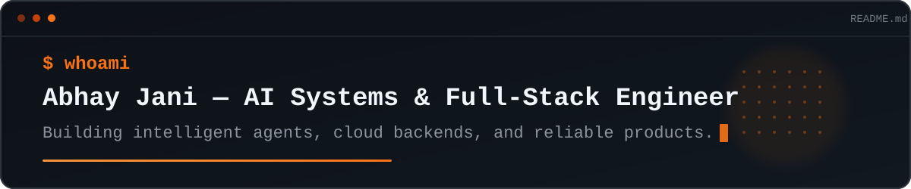

  

## `01 / About`

AI Systems & Full-Stack Engineer building intelligent agents, cloud backends, and cross-platform products.

- <code>→</code> Agentic AI, tool-driven workflows, and LLM product experiences
- <code>→</code> Backend APIs, AWS architecture, and reliable delivery systems
- <code>→</code> Modern web and mobile applications with TypeScript, Angular, and Ionic

## `02 / What I build`

| `AI / AGENTS` | `API / CLOUD` | `WEB / MOBILE` |
| :--- | :--- | :--- |
| Agent orchestration, tools, context, and knowledge flows | Backend services, authentication, realtime systems, and AWS | Responsive products across web, Android, and iOS |

## `03 / Core stack`

## `04 / Selected work`

- [`secure-code-reviewer`](https://github.com/abhayjaniit/secure-code-reviewer) — security review workflows for JavaScript and TypeScript projects
- [`ionic5-webrtc-demo`](https://github.com/abhayjaniit/ionic5-webrtc-demo) — cross-platform video conferencing with Ionic, WebRTC, and Firebase

Most current production work is private and focuses on AI agents, cloud systems, modernization, testing, and secure delivery.
